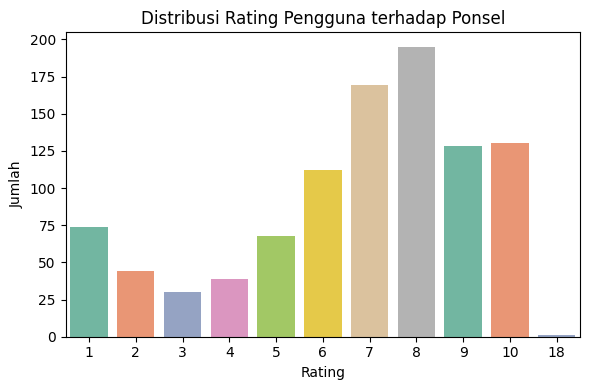
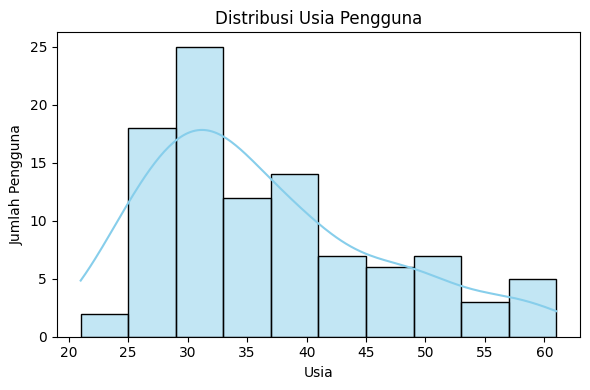
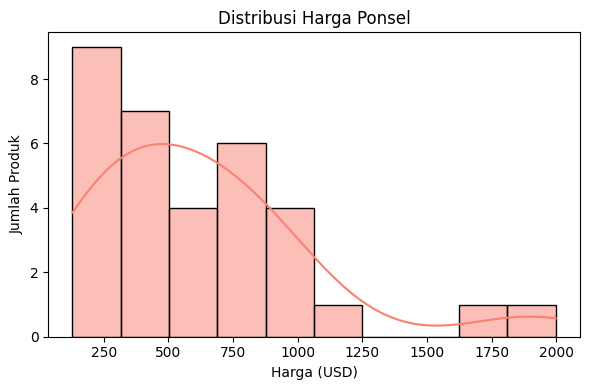
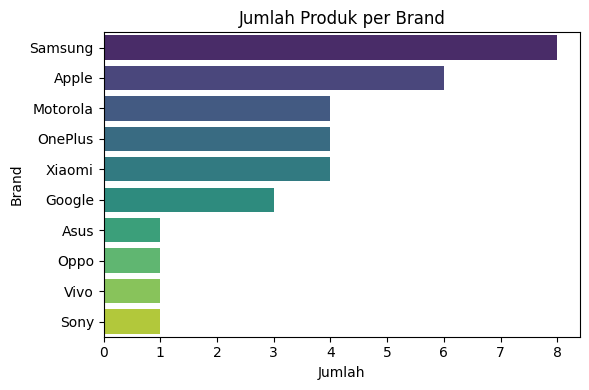
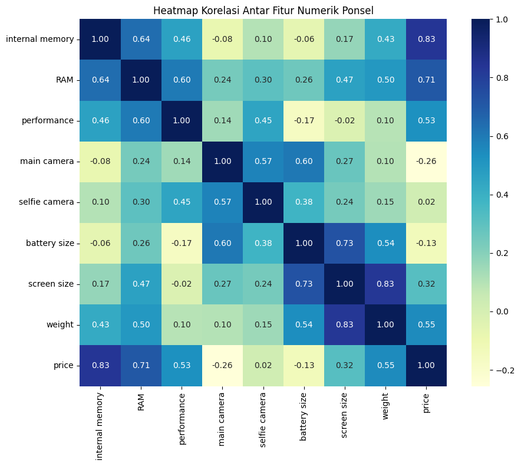
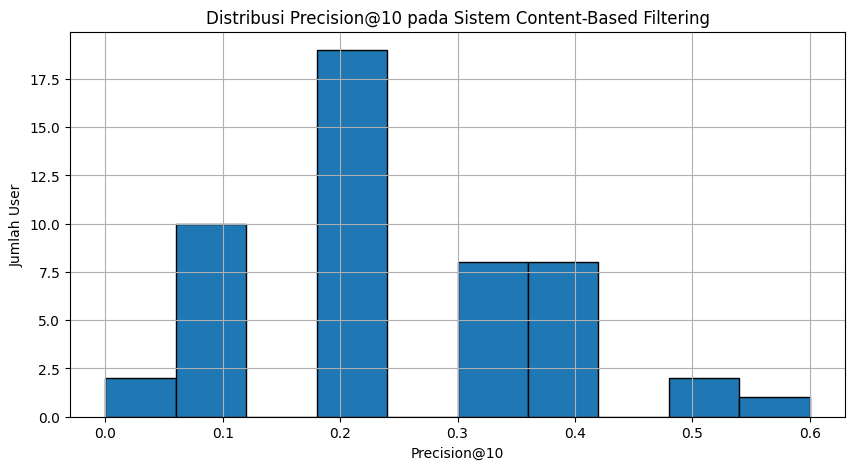
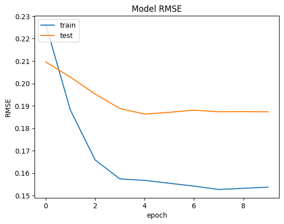
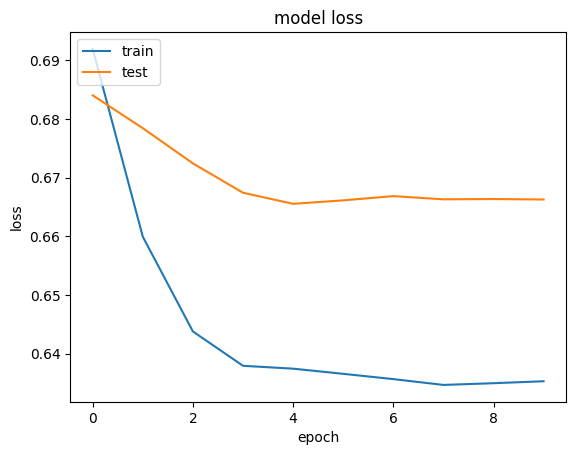

# Sistem Rekomendasi Handphone[Ahmad Radesta]

Proyek ini bertujuan untuk membangun sebuah sistem rekomendasi ponsel pintar berbasis data yang dapat membantu pengguna dalam memilih perangkat yang paling sesuai dengan preferensi dan kebutuhan mereka. Dengan memanfaatkan pendekatan Content-Based Filtering dan Collaborative Filtering, sistem ini dirancang untuk memberikan saran yang bersifat personal, relevan, dan informatif.

---

## 📌 1. Domain Proyek

Seiring dengan perkembangan teknologi, pasar ponsel pintar mengalami pertumbuhan yang sangat pesat dengan hadirnya berbagai merek dan model baru setiap tahunnya. Pengguna sering dihadapkan pada tantangan dalam memilih ponsel yang tepat dari sekian banyak pilihan yang tersedia. Kompleksitas spesifikasi teknis seperti kapasitas baterai, resolusi kamera, kecepatan prosesor, dan jenis sistem operasi membuat proses pengambilan keputusan menjadi semakin sulit, terutama bagi konsumen yang tidak memiliki pengetahuan teknis yang mendalam.

> Referensi:  
> Chandrahaas, B.V. & Panigrahi, Bhawani & Pande, Sagar & Swain, Nirmal. (2023). A Hybrid Approach for Mobile Phone Recommendation using Content-Based and Collaborative Filtering. EA! Endorsed Transactions on Internet of Things. 10.4108/eetiot.4594

> Web Information Systems Engineering – WISE 2014, 2014, Volume 8786 ISBN : 978-3-319-11748-5 Bozhi Yuan, Bin Xu, Tonglee Chung, Kaiyan Shuai, Yongbin Liu
---

## 🌟 2. Business Understanding

### Problem Statements
1. Bagaimana sistem dapat membantu pengguna menemukan ponsel yang paling sesuai dengan kebutuhan dan preferensi mereka berdasarkan riwayat rating?
2. Bagaimana sistem dapat merekomendasikan ponsel yang mirip dengan ponsel lama pengguna, bahkan ketika pengguna tidak memahami spesifikasi teknisnya?

### Goals
- Membangun sistem rekomendasi ponsel berbasis data rating pengguna sebelumnya agar sistem dapat mengusulkan produk yang paling disukai.

- Membangun sistem rekomendasi berdasarkan input model ponsel lama, sehingga pengguna bisa mendapatkan alternatif yang mirip dari segi fitur dan performa.

### Solution Statement
- Content-Based Filtering: Menggunakan fitur deskriptif dari ponsel (misalnya merek, model, sistem operasi) untuk memberikan rekomendasi yang serupa dengan produk yang pernah disukai pengguna.

- Collaborative Filtering: Menggunakan pola rating dari banyak pengguna untuk merekomendasikan produk berdasarkan kesamaan preferensi antar pengguna.

---

## 📊 3. Data Understanding

Dataset diambil dari [Cellphones Recomendation](https://www.kaggle.com/datasets/meirnizri/cellphones-recommendations/data).

**Informasi Dataset**

## 📊 Data Understanding

### 1. `cellphones data.csv`

Dataset ini berisi informasi deskriptif mengenai berbagai ponsel pintar yang menjadi objek rekomendasi.

- **Jumlah Data:** 33 baris × 14 kolom
- **Kolom Utama:**
  - `cellphone_id`: ID unik untuk setiap ponsel
  - `brand`: Merek ponsel (contoh: Apple, Samsung)
  - `model`: Model ponsel (contoh: iPhone 13)
  - `operating system`: Sistem operasi (iOS, Android, dll.)
  - `internal memory`, `RAM`: Spesifikasi penyimpanan dan memori
  - `performance`: Skor performa (kemungkinan dari benchmark)
  - `main camera`, `selfie camera`: Resolusi kamera (dalam MP)
  - `battery size`: Kapasitas baterai (mAh)
  - `screen size`: Ukuran layar (inci)
  - `weight`: Berat (gram)
  - `price`: Harga dalam USD
  - `release date`: Tanggal rilis

---

### 2. `cellphones ratings.csv`

Dataset ini berisi nilai rating yang diberikan oleh pengguna terhadap ponsel tertentu.

- **Jumlah Data:** 990 baris × 3 kolom
- **Kolom Utama:**
  - `user_id`: ID pengguna
  - `cellphone_id`: ID ponsel yang dirating
  - `rating`: Skala penilaian (0–10)

---

### 3. `cellphones users.csv`

Dataset ini memberikan informasi demografis pengguna yang memberikan rating.

- **Jumlah Data:** 99 baris × 4 kolom
- **Kolom Utama:**
  - `user_id`: ID unik pengguna
  - `age`: Usia pengguna
  - `gender`: Jenis kelamin
  - `occupation`: Pekerjaan pengguna

---

### 🔗 Ringkasan Keterkaitan

Ketiga dataset ini saling terhubung:
- `cellphones ratings.csv` mengaitkan pengguna (`user_id`) dan produk (`cellphone_id`) melalui rating.
- `cellphones users.csv` dapat dimanfaatkan untuk segmentasi atau rekomendasi berbasis demografi.
- `cellphones data.csv` menyediakan fitur deskriptif untuk diterapkan pada Content-Based Filtering.
---

Grafik di atas menunjukkan distribusi frekuensi nilai rating yang diberikan oleh pengguna terhadap berbagai ponsel.

- Skala rating berkisar dari **1 hingga 10**, dengan satu outlier di **18** yang kemungkinan merupakan data tidak valid.
- Rating paling banyak diberikan pada:
  - **8** (hampir 200 pengguna)
  - **7 dan 10**
- Nilai rating rendah (1–4) lebih jarang diberikan.

> 📌 **Insight**:
> - Pengguna cenderung memberikan **rating tinggi** pada ponsel yang mereka gunakan.
> - Perlu dilakukan **penanganan terhadap nilai anomali**, seperti rating `18`.

Grafik di atas menunjukkan distribusi usia dari pengguna yang memberikan rating terhadap ponsel.

- Mayoritas pengguna berusia **25 hingga 35 tahun**, dengan puncaknya sekitar **30 tahun**.
- Distribusi memiliki **kemiringan ke kanan (right-skewed)** — menandakan lebih sedikit pengguna yang berusia di atas 40 tahun.
- Terdapat pengguna dengan usia hingga **60 tahun**, meskipun dalam jumlah kecil.

Grafik di atas menunjukkan distribusi harga ponsel dalam dataset, dalam satuan **USD**.

- Sebagian besar ponsel berada dalam rentang harga **$100 hingga $600**.
- Distribusi bersifat **right-skewed (positif)** — menandakan sebagian kecil ponsel berada di kelas **premium** (di atas $1000).

- Terdapat sedikit ponsel dengan harga sangat tinggi, misalnya **$1750 hingga $2000**, yang merupakan flagship atau high-end devices.

Grafik di atas menunjukkan jumlah produk (ponsel) yang tersedia pada dataset berdasarkan merek.

- **Samsung** merupakan brand dengan jumlah produk terbanyak (**8 produk**), diikuti oleh:
  - **Apple** (6 produk)
  - **Motorola**, **OnePlus**, dan **Xiaomi** (masing-masing 4 produk)
- Brand seperti **Asus**, **Oppo**, **Vivo**, dan **Sony** hanya memiliki **1 produk** masing-masing.

Heatmap di atas menunjukkan tingkat korelasi antar fitur numerik dalam dataset ponsel.

#### 🔍 Highlight Korelasi Tinggi:
- **Internal memory** berkorelasi kuat dengan **price** (`0.83`)
- **RAM** berkorelasi kuat dengan **price** (`0.71`)
- **Screen size** memiliki korelasi tinggi dengan **weight** (`0.83`) dan **battery size** (`0.73`)
- **Performance** memiliki korelasi sedang dengan **RAM** (`0.60`) dan **price** (`0.53`)

#### 📌 Insight:
- Harga ponsel lebih dipengaruhi oleh spesifikasi teknis seperti:
  - **Kapasitas memori**
  - **RAM**
  - **Performa**
- Fitur seperti **main camera** dan **selfie camera** memiliki korelasi rendah terhadap harga.
- Ukuran dan berat ponsel saling berkaitan kuat, logis karena layar besar → berat bertambah.
---

# 🧹 Data Preparation

### 📌 Teknik Data Preparation
- Menggabungkan dataset menjadi satu.
- Handling Missing Values: Menghapus nilai yang hilang dalam dataset.
- Removing Outliers: Menghapus data dengan nilai outliers pada kolom tertentu.
- Mengubah format penulisan: Normalisasi huruf kecil (lowercase).
- Mereplace value: Perbaikan penulisan pada kolom occupation.
- Menghapus data duplikat berdasarkan ID.
- Transformasi data ke dalam format yang siap digunakan (list → DataFrame baru).

---

## 🧪 Proses Data Preparation

1. **Menggabungkan dataset**:
   - Dataset `cellphones rating` digabung dengan `cellphones data` melalui `cellphone_id`.
   - Hasilnya digabung lagi dengan dataset `cellphones users` melalui `user_id`.

2. **Menghapus nilai Null**:
   - Nilai kosong (missing value) ditemukan, terutama pada kolom `occupation`, kemudian dihapus menggunakan `dropna()`.

3. **Menghapus outlier**:
   - Outlier pada kolom `rating` dengan nilai `18` dihapus karena tidak valid dalam skala rating normal (1–10).

4. **Normalisasi format penulisan**:
   - Semua nilai pada kolom `occupation` diubah menjadi huruf kecil (`lowercase`).

5. **Perbaikan penulisan (replace value)**:
   - `'healthare'` diubah menjadi `'healthcare'`.
   - `'it'` diubah menjadi `'information technology'`.

6. **Menghapus data duplikat**:
   - Duplikat berdasarkan `cellphone_id` dihapus untuk menjaga keunikan data ponsel.

7. **Transformasi data**:
   - Nilai pada kolom `cellphone_id`, `brand`, `model`, dan `operating system` dikonversi ke dalam bentuk list.
   - List tersebut dikembalikan menjadi DataFrame baru bernama `phone_new` untuk digunakan pada proses berikutnya (TF-IDF dan sistem rekomendasi).

---

## 🤖 5. Modeling

Notebook ini membangun dua jenis sistem rekomendasi untuk ponsel, yaitu:

## 1. 📌 Content-Based Filtering

### 🎯 Tujuan
Merekomendasikan ponsel yang **mirip dengan ponsel tertentu** berdasarkan fitur-fitur deskriptif seperti brand, model, dan sistem operasi.

### 🔧 Teknik yang Digunakan

- **Fitur Deskriptif**: 
  - `brand`
  - `model`
  - `operating_system`
- **Langkah-langkah:**
  1. Menggabungkan semua fitur teks ke dalam satu kolom `combined_features`.
  2. Mengubah teks menjadi representasi numerik menggunakan **TF-IDF Vectorizer**.
  3. Menghitung **cosine similarity** antar vektor ponsel untuk menemukan kemiripan.
  4. Fungsi `get_recommendations(model_name)` mengembalikan **10 ponsel paling mirip**.

### ✅ Kelebihan

- Tidak membutuhkan interaksi pengguna sebelumnya.
- Dapat digunakan hanya dengan memilih ponsel yang disukai, cocok untuk **user baru (cold start)**.

---

## 2. 🤖 Collaborative Filtering (Neural Network-Based)

### 🎯 Tujuan
Merekomendasikan ponsel berdasarkan **pola rating dari pengguna lain yang mirip**.

### 🔧 Teknik yang Digunakan

- **Fitur**: Data interaksi berupa `user_id`, `cellphone_id`, dan `rating`.
- **Langkah-langkah:**
  1. Menggabungkan data rating dengan metadata ponsel.
  2. Encoding `user_id` dan `cellphone_id` ke bentuk numerik.
  3. Membuat **model neural network**:
     - Menggunakan **Embedding Layer** untuk user dan ponsel.
     - Melakukan dot product + bias dan aktivasi sigmoid.
  4. Model dilatih dengan **loss: Binary Crossentropy** dan metrik **RMSE**.
  5. Setelah pelatihan, model dapat:
     - Memprediksi rating untuk ponsel yang belum dirating user.
     - Memberikan rekomendasi top-N berdasarkan skor prediksi tertinggi.

### ✅ Kelebihan

- Rekomendasi **lebih personal** karena mempertimbangkan pola interaksi banyak pengguna.
- Mampu menangkap selera pengguna berdasarkan perilaku historis, bukan hanya fitur produk.

---

## 📊 Perbandingan

| Metode                 | Kelebihan                                                   | Kekurangan                                                  |
|------------------------|-------------------------------------------------------------|-------------------------------------------------------------|
| Content-Based          | Tidak perlu data rating, cocok untuk user/item baru         | Terbatas hanya pada fitur yang dimiliki ponsel              |
| Collaborative Filtering| Rekomendasi lebih personal berdasarkan pola pengguna lain   | Tidak bekerja baik jika data rating sedikit (cold start)    |

---

## 📏 6. Evaluation

Grafik di atas menunjukkan distribusi Precision@10 pada sistem Content-Based Filtering. Grafik ini menggambarkan jumlah pengguna pada berbagai nilai Precision@10, dengan sebagian besar pengguna memiliki Precision@10 rendah, dan sejumlah kecil pengguna menunjukkan nilai Precision@10 yang lebih tinggi.

Grafik ini menunjukkan perkembangan **Root Mean Squared Error (RMSE)** selama proses pelatihan model rekomendasi berbasis Neural Network.

#### 🧾 Keterangan:
- **Garis biru**: RMSE pada data pelatihan (*train*).
- **Garis oranye**: RMSE pada data validasi (*test*).

#### 🔍 Insight:
- RMSE pada data pelatihan terus menurun dari awal hingga akhir, menandakan model belajar dengan baik terhadap data historis.
- RMSE pada data validasi juga menurun secara signifikan pada awal epoch, kemudian stabil di sekitar nilai **0.187–0.189**.
- Tidak terjadi peningkatan drastis (*spike*) pada RMSE validasi, sehingga **overfitting tidak terdeteksi secara signifikan**.

Grafik di atas menunjukkan perkembangan nilai loss selama proses pelatihan model rekomendasi berbasis Neural Network menggunakan Collaborative Filtering.

#### 📊 Penjelasan:
- **Garis biru** menunjukkan *training loss*.
- **Garis oranye** menunjukkan *validation loss* (test).

#### 🔍 Insight:
- Terlihat bahwa nilai training loss **terus menurun stabil**, menandakan model mampu mempelajari pola data dengan baik.
- Validation loss juga ikut menurun di awal, lalu mulai stagnan setelah epoch ke-4 hingga ke-10.
- Tidak ada overfitting yang signifikan hingga epoch ke-10, namun **gap antara training dan validation loss** menunjukkan bahwa model masih dapat ditingkatkan melalui:
  - **Regularisasi** (dropout atau weight decay)
  - **Penyesuaian arsitektur embedding**
  - **Peningkatan jumlah data rating**

---

# 🎯 Menampilkan Rekomendasi Ponsel untuk Pengguna Tertentu

Bagian ini bertujuan untuk **menguji model rekomendasi** dengan memilih satu pengguna secara acak dan menghasilkan daftar ponsel yang disarankan berdasarkan prediksi model.
### 🎯 Hasil Rekomendasi Ponsel untuk User ID: 27

Model rekomendasi berbasis Collaborative Filtering berhasil menghasilkan saran ponsel untuk pengguna tertentu berdasarkan preferensi historisnya. Berikut adalah hasilnya:

---

#### ✅ Ponsel dengan Rating Tertinggi oleh Pengguna
Ponsel-ponsel berikut ini merupakan yang paling disukai oleh pengguna berdasarkan histori rating yang telah diberikan:

1. **iPhone 13 Pro Max**
2. **10T**
3. **Galaxy A32**
4. **Moto G Power (2022)**
5. **Galaxy S22 Plus**

---

#### 🤖 Top 10 Rekomendasi Ponsel untuk Pengguna Ini
Berdasarkan model prediksi, sistem menyarankan ponsel berikut yang belum dirating oleh pengguna, namun diprediksi sangat cocok:

1. **iPhone SE (2022)**
2. **iPhone 13 Mini**
3. **iPhone 13**
4. **iPhone XR**
5. **Pixel 6 Pro**
6. **Galaxy S22**
7. **10 Pro**
8. **iPhone 13 Pro**
9. **Find X5 Pro**
10. **Xperia Pro**

---

#### 📌 Insight:
- Rekomendasi sangat condong ke **brand Apple dan flagship Android** seperti Pixel dan Galaxy, mencerminkan bahwa model telah belajar dari preferensi sebelumnya.
- Model berhasil menyarankan produk dengan **kemiripan teknis dan popularitas** yang sesuai dengan ponsel yang pernah disukai pengguna.
- Rekomendasi ini sangat relevan dalam konteks aplikasi e-commerce, sistem katalog, atau layanan konsultasi pembelian ponsel.

