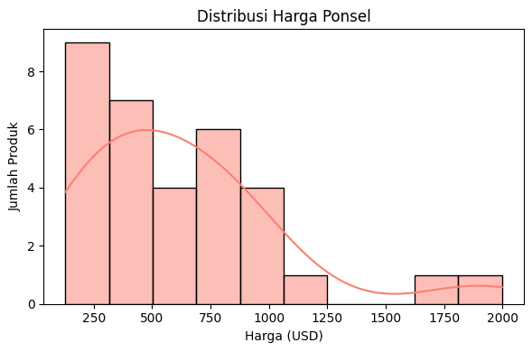

# Sistem Rekomendasi Handphone[Ahmad Radesta]

Proyek ini bertujuan untuk membangun sebuah sistem rekomendasi ponsel pintar berbasis data yang dapat membantu pengguna dalam memilih perangkat yang paling sesuai dengan preferensi dan kebutuhan mereka. Dengan memanfaatkan pendekatan Content-Based Filtering dan Collaborative Filtering, sistem ini dirancang untuk memberikan saran yang bersifat personal, relevan, dan informatif.

---

## 📌 1. Domain Proyek

Seiring dengan perkembangan teknologi, pasar ponsel pintar mengalami pertumbuhan yang sangat pesat dengan hadirnya berbagai merek dan model baru setiap tahunnya. Pengguna sering dihadapkan pada tantangan dalam memilih ponsel yang tepat dari sekian banyak pilihan yang tersedia. Kompleksitas spesifikasi teknis seperti kapasitas baterai, resolusi kamera, kecepatan prosesor, dan jenis sistem operasi membuat proses pengambilan keputusan menjadi semakin sulit, terutama bagi konsumen yang tidak memiliki pengetahuan teknis yang mendalam.

> Referensi:  
> Chandrahaas, B.V. & Panigrahi, Bhawani & Pande, Sagar & Swain, Nirmal. (2023). A Hybrid Approach for Mobile Phone Recommendation using Content-Based and Collaborative Filtering. EA! Endorsed Transactions on Internet of Things. 10.4108/eetiot.4594

> Web Information Systems Engineering – WISE 2014, 2014, Volume 8786 ISBN : 978-3-319-11748-5 Bozhi Yuan, Bin Xu, Tonglee Chung, Kaiyan Shuai, Yongbin Liu
---

## 🌟 2. Business Understanding

### Problem Statements
1. Bagaimana sistem dapat membantu pengguna menemukan ponsel yang paling sesuai dengan kebutuhan dan preferensi mereka berdasarkan riwayat rating?
2. Bagaimana sistem dapat merekomendasikan ponsel yang mirip dengan ponsel lama pengguna, bahkan ketika pengguna tidak memahami spesifikasi teknisnya?

### Goals
- Membangun sistem rekomendasi ponsel berbasis data rating pengguna sebelumnya agar sistem dapat mengusulkan produk yang paling disukai.

- Membangun sistem rekomendasi berdasarkan input model ponsel lama, sehingga pengguna bisa mendapatkan alternatif yang mirip dari segi fitur dan performa.

### Solution Statement
- Content-Based Filtering: Menggunakan fitur deskriptif dari ponsel (misalnya merek, model, sistem operasi) untuk memberikan rekomendasi yang serupa dengan produk yang pernah disukai pengguna.

- Collaborative Filtering: Menggunakan pola rating dari banyak pengguna untuk merekomendasikan produk berdasarkan kesamaan preferensi antar pengguna.

---

## 📊 3. Data Understanding

Dataset diambil dari [Cellphones Recomendation](https://www.kaggle.com/datasets/meirnizri/cellphones-recommendations/data).

**Informasi Dataset**

## 📊 Data Understanding

### 1. `cellphones data.csv`

Dataset ini berisi informasi deskriptif mengenai berbagai ponsel pintar yang menjadi objek rekomendasi.

- **Jumlah Data:** 33 baris × 14 kolom
- **Kolom Utama:**
  - `cellphone_id`: ID unik untuk setiap ponsel
  - `brand`: Merek ponsel (contoh: Apple, Samsung)
  - `model`: Model ponsel (contoh: iPhone 13)
  - `operating system`: Sistem operasi (iOS, Android, dll.)
  - `internal memory`, `RAM`: Spesifikasi penyimpanan dan memori
  - `performance`: Skor performa (kemungkinan dari benchmark)
  - `main camera`, `selfie camera`: Resolusi kamera (dalam MP)
  - `battery size`: Kapasitas baterai (mAh)
  - `screen size`: Ukuran layar (inci)
  - `weight`: Berat (gram)
  - `price`: Harga dalam USD
  - `release date`: Tanggal rilis

---

### 2. `cellphones ratings.csv`

Dataset ini berisi nilai rating yang diberikan oleh pengguna terhadap ponsel tertentu.

- **Jumlah Data:** 990 baris × 3 kolom
- **Kolom Utama:**
  - `user_id`: ID pengguna
  - `cellphone_id`: ID ponsel yang dirating
  - `rating`: Skala penilaian (0–10)

---

### 3. `cellphones users.csv`

Dataset ini memberikan informasi demografis pengguna yang memberikan rating.

- **Jumlah Data:** 99 baris × 4 kolom
- **Kolom Utama:**
  - `user_id`: ID unik pengguna
  - `age`: Usia pengguna
  - `gender`: Jenis kelamin
  - `occupation`: Pekerjaan pengguna

---

### 🔗 Ringkasan Keterkaitan

Ketiga dataset ini saling terhubung:
- `cellphones ratings.csv` mengaitkan pengguna (`user_id`) dan produk (`cellphone_id`) melalui rating.
- `cellphones users.csv` dapat dimanfaatkan untuk segmentasi atau rekomendasi berbasis demografi.
- `cellphones data.csv` menyediakan fitur deskriptif untuk diterapkan pada Content-Based Filtering.
---

Grafik di atas menunjukkan distribusi frekuensi nilai rating yang diberikan oleh pengguna terhadap berbagai ponsel.

- Skala rating berkisar dari **1 hingga 10**, dengan satu outlier di **18** yang kemungkinan merupakan data tidak valid.
- Rating paling banyak diberikan pada:
  - **8** (hampir 200 pengguna)
  - **7 dan 10**
- Nilai rating rendah (1–4) lebih jarang diberikan.

> 📌 **Insight**:
> - Pengguna cenderung memberikan **rating tinggi** pada ponsel yang mereka gunakan.
> - Perlu dilakukan **penanganan terhadap nilai anomali**, seperti rating `18`.

Grafik di atas menunjukkan distribusi usia dari pengguna yang memberikan rating terhadap ponsel.

- Mayoritas pengguna berusia **25 hingga 35 tahun**, dengan puncaknya sekitar **30 tahun**.
- Distribusi memiliki **kemiringan ke kanan (right-skewed)** — menandakan lebih sedikit pengguna yang berusia di atas 40 tahun.
- Terdapat pengguna dengan usia hingga **60 tahun**, meskipun dalam jumlah kecil.

Grafik di atas menunjukkan distribusi harga ponsel dalam dataset, dalam satuan **USD**.

- Sebagian besar ponsel berada dalam rentang harga **$100 hingga $600**.
- Distribusi bersifat **right-skewed (positif)** — menandakan sebagian kecil ponsel berada di kelas **premium** (di atas $1000).

- Terdapat sedikit ponsel dengan harga sangat tinggi, misalnya **$1750 hingga $2000**, yang merupakan flagship atau high-end devices.

Grafik di atas menunjukkan jumlah produk (ponsel) yang tersedia pada dataset berdasarkan merek.

- **Samsung** merupakan brand dengan jumlah produk terbanyak (**8 produk**), diikuti oleh:
  - **Apple** (6 produk)
  - **Motorola**, **OnePlus**, dan **Xiaomi** (masing-masing 4 produk)
- Brand seperti **Asus**, **Oppo**, **Vivo**, dan **Sony** hanya memiliki **1 produk** masing-masing.

Heatmap di atas menunjukkan tingkat korelasi antar fitur numerik dalam dataset ponsel.

#### 🔍 Highlight Korelasi Tinggi:
- **Internal memory** berkorelasi kuat dengan **price** (`0.83`)
- **RAM** berkorelasi kuat dengan **price** (`0.71`)
- **Screen size** memiliki korelasi tinggi dengan **weight** (`0.83`) dan **battery size** (`0.73`)
- **Performance** memiliki korelasi sedang dengan **RAM** (`0.60`) dan **price** (`0.53`)

#### 📌 Insight:
- Harga ponsel lebih dipengaruhi oleh spesifikasi teknis seperti:
  - **Kapasitas memori**
  - **RAM**
  - **Performa**
- Fitur seperti **main camera** dan **selfie camera** memiliki korelasi rendah terhadap harga.
- Ukuran dan berat ponsel saling berkaitan kuat, logis karena layar besar → berat bertambah.
---

# 🧹 Data Preparation

Tahapan data preparation dilakukan untuk memastikan data yang digunakan dalam pelatihan model bersih, relevan, dan dalam format yang sesuai dengan kebutuhan algoritma machine learning.

---

## 🔧 Teknik yang Digunakan

- **Handling Missing Values**  
  Menghapus atau mengisi nilai kosong untuk menjaga integritas data.

- **Removing Outliers**  
  Menghapus nilai ekstrem pada kolom numerik untuk mencegah distorsi model.

- **Dropping Irrelevant Features**  
  Menghapus fitur yang tidak memiliki kontribusi prediktif atau memiliki nilai yang seragam.

- **Encoding Categorical Variables**  
  Mengubah variabel kategorikal menjadi format numerik menggunakan *One-Hot Encoding*.

- **Train-Test Split**  
  Membagi dataset menjadi data latih dan uji dengan rasio 80:20.

- **Feature Scaling**  
  Melakukan standarisasi nilai pada fitur numerik agar semua fitur memiliki skala yang setara menggunakan `StandardScaler`.

---

## 🧪 Rincian Proses Data Preparation

- Fitur dengan **jumlah missing value < 100** dihapus dari dataset.
- Fitur dengan **jumlah missing value > 1000** dilakukan imputasi.
- Outlier diatasi menggunakan metode **Interquartile Range (IQR)**.
- Fitur `id`, `latitude`, `longitude`, dan `time` dihapus karena tidak memberikan nilai tambah secara prediktif.
- Fitur `category`, `currency`, `fee`, dan `price_type` dihapus karena memiliki nilai yang sama di seluruh baris data.
- Fitur kategorikal dikonversi menggunakan **One-Hot Encoding**.
- Dataset dibagi menjadi:
  
  | Jenis Dataset  | Jumlah |
  |----------------|--------|
  | Keseluruhan    | 8,136  |
  | Data Latih     | 6,508  |
  | Data Uji       | 1,628  |

- Skala fitur numerik dinormalisasi menggunakan **StandardScaler** pada data latih dan data uji.

---

## 🎯 Alasan Dilakukannya Tahapan Ini

- **Mengatasi Missing Values**  
  Untuk menghindari error saat proses training model.

- **Menghapus Outlier**  
  Untuk meningkatkan akurasi model dan menghindari bias akibat nilai ekstrem.

- **Menghapus Fitur Tak Relevan**  
  Untuk menyederhanakan model dan mengurangi beban komputasi.

- **Encoding Variabel Kategorikal**  
  Agar data dapat diproses oleh algoritma yang hanya menerima input numerik.

- **Pembagian Data 80:20**  
  Untuk memastikan data latih cukup besar, sekaligus menyediakan data uji yang representatif.

- **Standarisasi Fitur**  
  Agar model tidak bias terhadap fitur yang memiliki skala lebih besar.

---

## 🤖 5. Modeling

## 🔍 Model yang Digunakan

### 🔹 Support Vector Regression (SVR)
- **Parameter:** default
- **Deskripsi:** Memproyeksikan data ke dimensi yang lebih tinggi untuk menemukan hyperplane terbaik dalam margin error tertentu. Cocok untuk regresi non-linear.

---

### 🔹 K-Nearest Neighbors (KNN)
- **Parameter:** `n_neighbors=4`
- **Deskripsi:** Melakukan prediksi berdasarkan rata-rata nilai dari 4 tetangga terdekat berdasarkan jarak euclidean atau metrik lainnya.

---

### 🔹 Random Forest
- **Parameter:** `random_state=42`
- **Deskripsi:** Merupakan ensemble dari banyak pohon keputusan. Mengurangi overfitting dan meningkatkan akurasi dengan menggunakan data acak dan fitur subset.

---

### 🔹 Gradient Boosting
- **Parameter:** `random_state=42`
- **Deskripsi:** Metode boosting yang membangun model secara iteratif, setiap model memperbaiki kesalahan dari model sebelumnya.

---

### 🔹 XGBoost
- **Parameter:** `verbosity=0`, `random_state=42`
- **Deskripsi:** Implementasi boosting yang cepat dan efisien, dengan kemampuan regularisasi (L1/L2) untuk menghindari overfitting.

---

### 🔹 CatBoost
- **Parameter:** `verbose=0`, `random_state=42`
- **Deskripsi:** Algoritma boosting yang optimal untuk data kategorikal dan tidak memerlukan preprocessing yang kompleks.

---

## ✅ Kelebihan dan Kekurangan Setiap Model

### SVR
- **Kelebihan:**
  - Cocok untuk data non-linear.
  - Bisa dikontrol menggunakan parameter epsilon.
- **Kekurangan:**
  - Lambat saat digunakan pada dataset besar.
  - Sangat sensitif terhadap skala fitur.

---

### KNN
- **Kelebihan:**
  - Simpel dan mudah dipahami.
  - Tidak membutuhkan proses pelatihan eksplisit.
- **Kekurangan:**
  - Tidak efisien untuk dataset besar.
  - Sensitif terhadap outlier dan skala fitur.

---

### Random Forest
- **Kelebihan:**
  - Akurat dan tahan terhadap overfitting.
  - Cocok untuk data kompleks dan beragam.
- **Kekurangan:**
  - Kurang interpretatif.
  - Membutuhkan sumber daya komputasi lebih besar.

---

### Gradient Boosting
- **Kelebihan:**
  - Akurasi tinggi.
  - Efektif dalam menangani outlier.
- **Kekurangan:**
  - Membutuhkan tuning hyperparameter.
  - Proses pelatihan relatif lambat.

---

### XGBoost
- **Kelebihan:**
  - Sangat efisien dan cepat.
  - Mendukung regularisasi (L1, L2).
- **Kekurangan:**
  - Pengaturan parameter cukup kompleks.

---

### CatBoost
- **Kelebihan:**
  - Dapat menangani data kategorikal tanpa encoding manual.
  - Minim kebutuhan preprocessing.
- **Kekurangan:**
  - Dokumentasi lebih terbatas dibanding XGBoost.
  - Waktu pelatihan awal bisa lebih lambat.

---

## 📏 6. Evaluation

### Metrik yang Digunakan:
- **RMSE (Root Mean Squared Error)**: Rata-rata kuadrat error, sensitif terhadap outlier.
- **MAE (Mean Absolute Error)**: Rata-rata selisih absolut antara aktual dan prediksi.
- **R² Score**: Proporsi variasi target yang bisa dijelaskan oleh model.

### Hasil Evaluasi:

## 🧪 Tabel Hasil Evaluasi

| No | Model              |     RMSE     |     MAE      | R² Score  |
|----|--------------------|--------------|--------------|-----------|
| 1  | Gradient Boosting  | **441.08**   | 372.08       | 0.1231    |
| 2  | Random Forest      | 463.08       | 385.64       | 0.0335    |
| 3  | SVR                | 479.37       | **372.03**   | -0.0358   |
| 4  | CatBoost           | 490.86       | 420.44       | -0.0860   |
| 5  | XGBoost            | 534.93       | 462.75       | -0.2898   |
| 6  | KNN                | 568.38       | 479.07       | -0.4561   |

---

## 📌 Kesimpulan

- **Gradient Boosting** menunjukkan performa terbaik secara keseluruhan dengan nilai **RMSE dan R² Score tertinggi** di antara semua model.
- **SVR** memiliki **MAE terendah**, menunjukkan error rata-rata prediksi yang kecil secara absolut, meskipun R²-nya negatif.
- **KNN** dan **XGBoost** memiliki performa paling rendah berdasarkan semua metrik, menunjukkan bahwa model ini kurang cocok untuk dataset ini tanpa tuning lebih lanjut.

